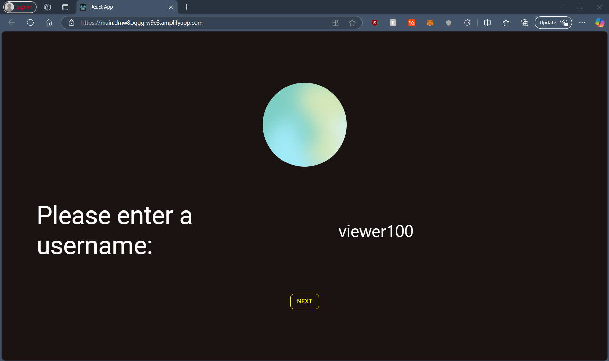
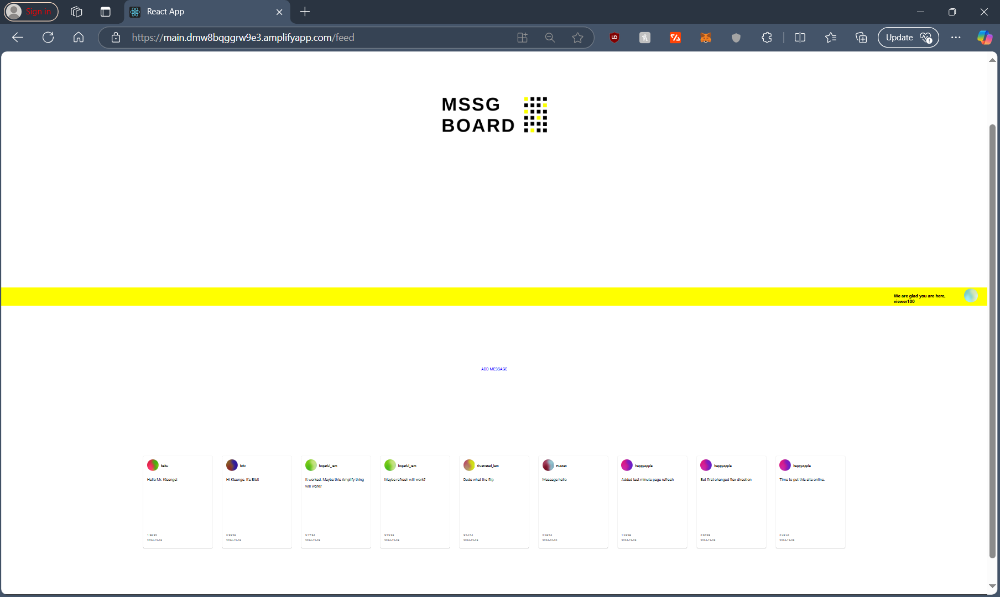

# mssgBoard Projects

[Link to project](https://main.dmw8bqggrw9e3.amplifyapp.com/)

## Purpose

The purpose of this project was to fully create and host a React project online. The app is a simple message board app where anybosy can leave a short message which will then be posted and remain on the feed. It was fun to make!

## Technology/Stack Used

- The frontend design and backend logic was written using the React Javascript framework.
- I used a postgres SQL database which was hosted online using Supabase.
- The react app was hosted online using AWS Amplify.

